# Database & Ingestion Pipeline***

Automatically fetches the latest user reviews and metadata from the ChatGPT app on Google Play, and stores them into Snowflake.
- Python script to collect and upload data
- Snowflake integration
- GitHub Actions for automated scheduling 
- Two structured tables: reviews and app_metadata

**Data Schema**

| Column        | Type      | Description               |
| ------------- | --------- | ------------------------- |
| `review_id`   | STRING    | Unique ID per review      |
| `user_name`   | STRING    | Display name of reviewer  |
| `content`     | TEXT      | Review content            |
| `score`       | INT       | Rating (1–5)              |
| `created_at`  | TIMESTAMP | Date & time of review     |
| `app_version` | STRING    | App version of the review |

| Column          | Type      | Description                       |
| --------------- | --------- | --------------------------------- |
| `app_id`        | STRING    | App ID (e.g., com.openai.chatgpt) |
| `version`       | STRING    | App version                       |
| `title`         | STRING    | App title                         |
| `score`         | FLOAT     | Average rating                    |
| `ratings`       | INT       | Total number of ratings           |
| `reviews`       | INT       | Total number of reviews           |
| `real_installs` | INT       | Estimated installs                |
| `free`          | BOOLEAN   | Whether app is free               |
| `price`         | FLOAT     | App price (USD)                   |
| `currency`      | STRING    | Currency symbol                   |
| `iap`           | BOOLEAN   | In-app purchases available        |
| `iap_range`     | STRING    | In-app price range                |
| `fetched_at`    | TIMESTAMP | When the metadata was collected   |

**GitHub Actions Schedule**
This project is set up to run automatically every 2 weeks or trigger manually via GitHub UI
Using cron inside .github/workflows/sync.yml

# ChatGPT App Review Analysis 

## 1. Basic Data Overview

The dataset ChatGPT_Review.csv contains 1,477,847 user reviews of ChatGPT.  

**Main columns:**  
- reviewId: Unique ID of each review  
- userName: Reviewer name  
- score: Rating (1–5)  
- content: User review text  
- thumbsUpCount: Helpful votes  
- reviewCreatedVersion: App version number  
- at: Date of review  
- replyContent: Developer reply text  
- repliedAt: Reply date  

## 2. Data Quality & Bias Check

### 2.1 Missing Value Analysis
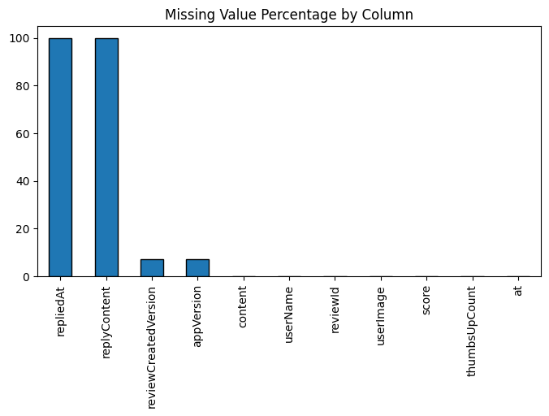

The chart "Missing Value Percentage by Column" summarizes data completeness across all variables.  

- Developer Reply:  
  "replyContent" and "repliedAt" are almost entirely missing, showing that developers rarely respond to user reviews.  
- Version Information:  
  About 7% of entries lack "reviewCreatedVersion" or "appVersion". This is likely tied to early app releases.  
- Core Attributes:  
  "content", "score", and "at" are nearly complete, ensuring strong reliability for sentiment and rating analyses. 

### 2.2 Uniqueness & User Activity

- No Duplicate Records:  
  "reviewId" has 0 duplicates, confirming each review is unique.  
- User Statistics:  
  There are about 1.22M unique users, of which 81K (6.7%) posted more than one review. They were labeled with "is_active_user".  

## 3. Rating Analysis

### 3.1 Rating Distribution

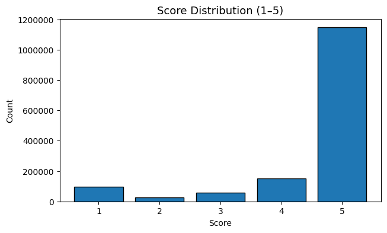

The histogram "Score Distribution" reveals a strongly right-skewed distribution.  
Most users rated the app 5 stars, while a smaller group provided 1-star ratings.  
Scores of 2–4 stars account for only a small fraction of all reviews, indicating that users tend to express extreme opinions rather than moderate evaluations.  

Bias:  
This may introduce bias in downstream natural language processing tasks.  
Sentiment models trained on such data could overfit to positive language patterns while underrepresenting negative expressions.

Recommendation:  
It is advisable to apply stratified sampling to ensure both positive and negative feedback are represented during model training.  

## 4. Word Count Analysis

### 4.1 Review Length Distribution

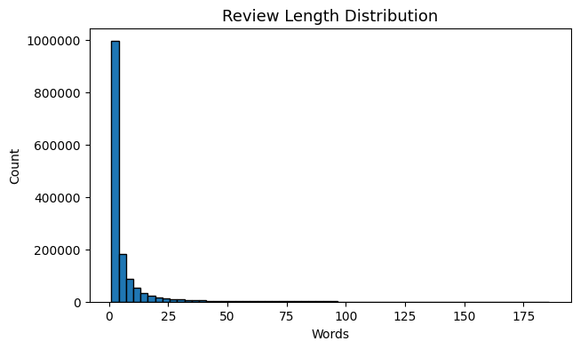

The histogram "Review Length Distribution" and descriptive statistics reveal a highly right-skewed distribution.  
The average review length is about 6.3 words, while the median is only 3 words, indicating that most users write extremely short comments. At least 25% of reviews contain only a single word, providing minimal linguistic context for NLP-based analysis.  

Recommendation:  
Apply text-length filtering or weighting so that analyses focus on more informative reviews.  

### 4.2 Review Length by Rating

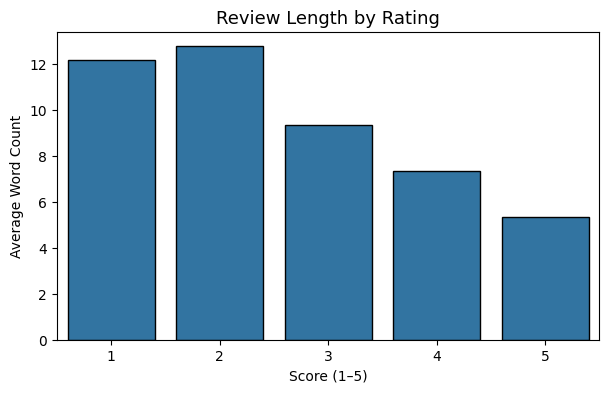

The chart "Review Length by Rating" shows a negative correlation between rating score and review length.  

- Negative reviews are typically longer and more descriptive.  
- Positive reviews are generally short.  

Bias:  
This inverse relationship suggests that textual richness is concentrated in negative feedback, while overall volume is dominated by short positive comments.  

Recommendation: 
Apply stratification or length-based weighting to prevent short positive texts from overshadowing more informative negative reviews.  

## 5. Sentiment Analysis

### 5.1 Sentiment Correlation

To assess how textual sentiment aligns with user ratings, VADER was applied to each review’s content. The Pearson correlation** between sentiment and rating is 0.3977, indicating a moderate positive relationship.  
Reviews with more positive language tend to receive higher ratings. However, the correlation is imperfect, suggesting some mismatches due to sarcasm, translation noise, or inconsistent user behavior. Data cleaning and preprocessing are essential before modeling.  

### 5.2 Sentiment & Rating Over Time

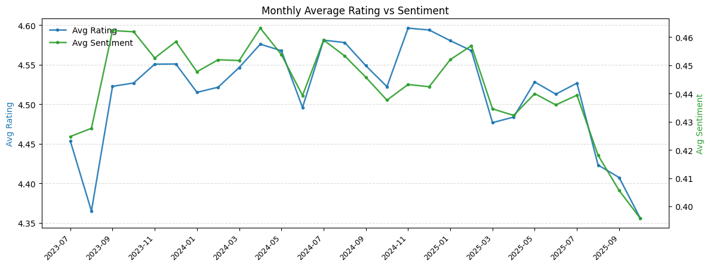

The chart "Monthly Average Rating vs Sentiment" shows that rating and sentiment move together across most months.  
This validates that text sentiment and numeric ratings capture similar user experience trends.  
Emotional fluctuations appear faster in sentiment scores than in ratings.  

### 5.3 Correlation Over Time

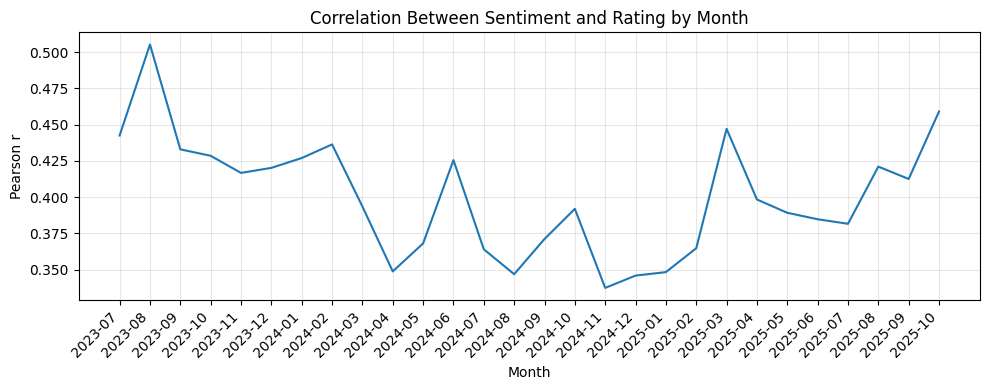

The chart "Correlation Between Sentiment and Rating by Month" shows that sentiment and rating remain positively aligned but not uniformly stable. Weaker correlations often arise from emoji-only feedback or translation artifacts.  

### 5.4 Sentiment Distribution by Rating

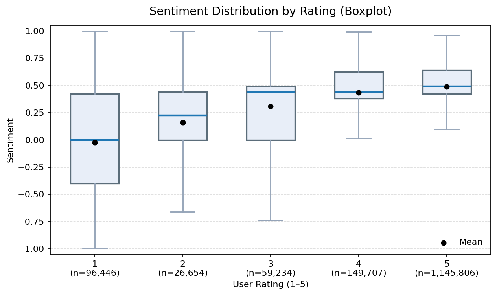

- Upward trend: Sentiment scores increase steadily with higher ratings.  
- Large variance in low ratings: 1–2 star reviews show more sentiment dispersion.  
- Compressed distribution: 4–5★ reviews cluster tightly around positive sentiment.  

### 5.5 WordCloud Analysis

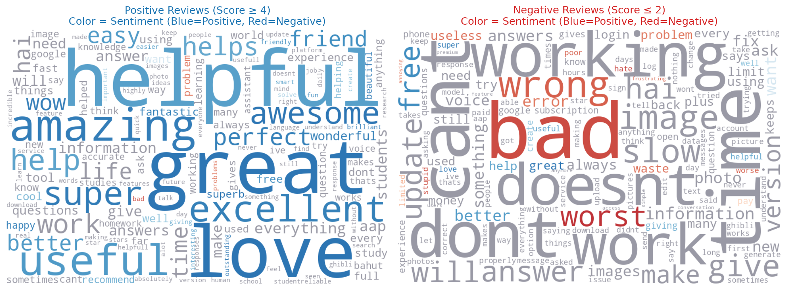

The size of each word reflects frequency; color shows sentiment  
(blue = positive, red = negative, gray = neutral).  

Positive Reviews (Score ≥ 4): 
Dominant words: helpful, great, love, amazing, useful, excellent, awesome, super, perfect, easy, life.  
These indicate strong emotional engagement and approval of usability.  

Negative Reviews (Score ≤ 2):
Frequent words: bad, wrong, slow, doesn’t, work, update, image, login, problem.
They highlight functionality issues, performance complaints, and access restrictions.  

Overall, positive reviews express satisfaction; negative reviews provide actionable usability feedback.  

## 6. Sarcastic or Misclassified Reviews

### 6.1 Detection

Filtering reviews with score = 1 but sentiment > 0.5 detected 10,866 potentially sarcastic or misclassified comments.  

Examples include ironic or contrastive phrasing like:  
- "its the best like fr" → sarcasm  
- "was a great app until they stop letting you have creative freedom" → contrastive sentiment  

### 6.2 Monthly Trend

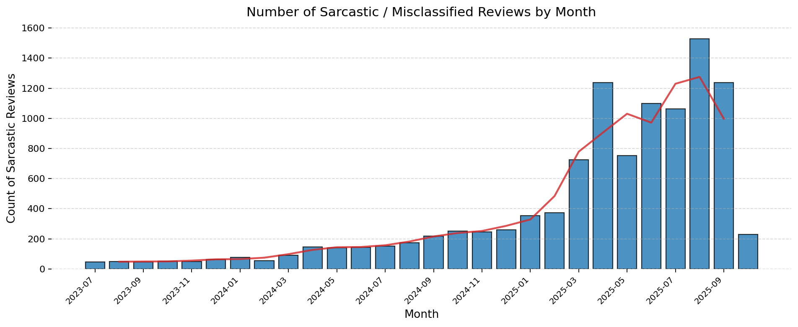

The figure "Number of Sarcastic / Misclassified Reviews by Month" shows a steady rise from late-2023 to mid-2025, peaking in 2025-04–2025-09. This indicates a growing use of positive words with ironic intent.  

### 6.3 Version Trend

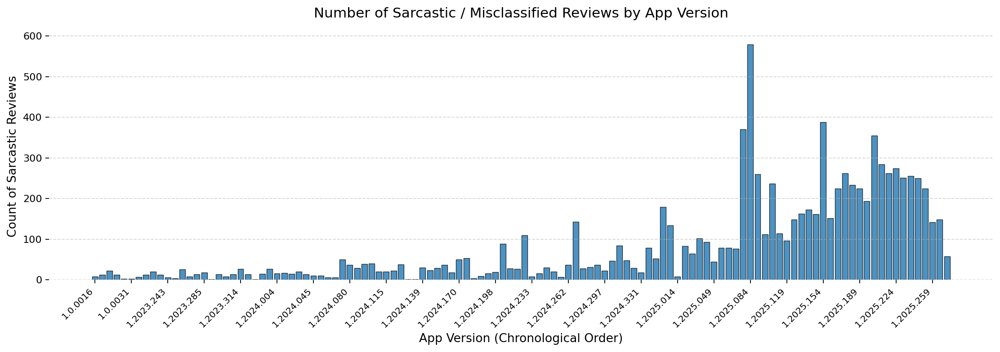

The chart "Sarcastic / Misclassified Reviews by App Version" shows concentration between 1.2025.07x–1.2025.23x, suggesting release-specific issues triggered sarcastic or mismatched language.  

## 7. Time Trends

### 7.1 Monthly Review Volume & Average Rating

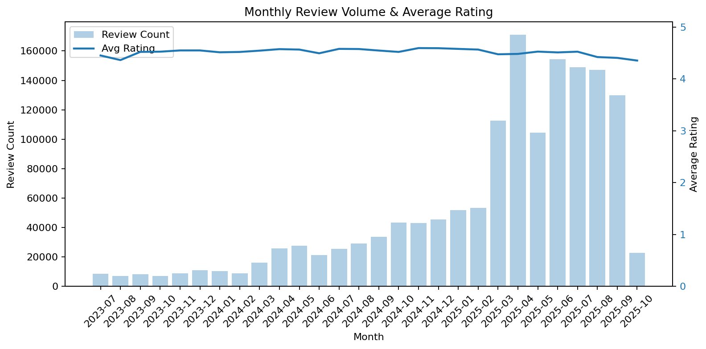

Review volume was stable in 2023, then rose sharply in 2024, peaking in 2025 Mar–May.  
Average ratings remained high but dipped slightly mid-2025.  

This reflects rapid user growth combined with mild rating decline, likely due to higher expectations and expanding user diversity rather than a single event.  

### 7.2 Average Review Length Over Time

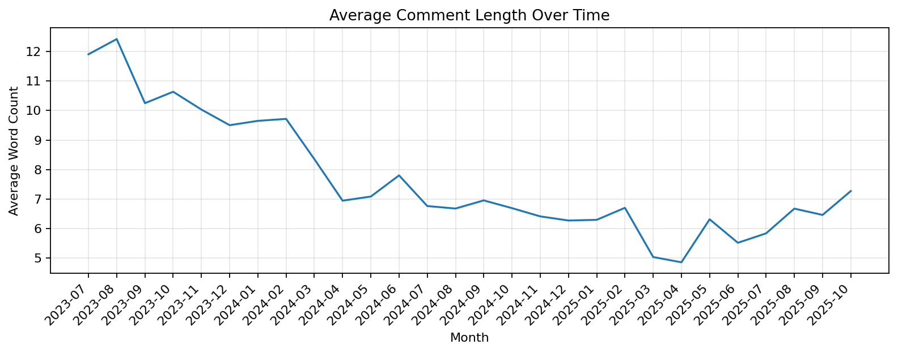

Average comment length dropped from 12 words (2023) to ~5 words (early 2025), before rebounding to 6–7 words.  
The drop corresponds to more short 5 star reviews, while the rebound aligns with mid-2025’s slight rating decline.  

## 8. Version Trends

### 8.1 Average Rating and Review Volume by Version

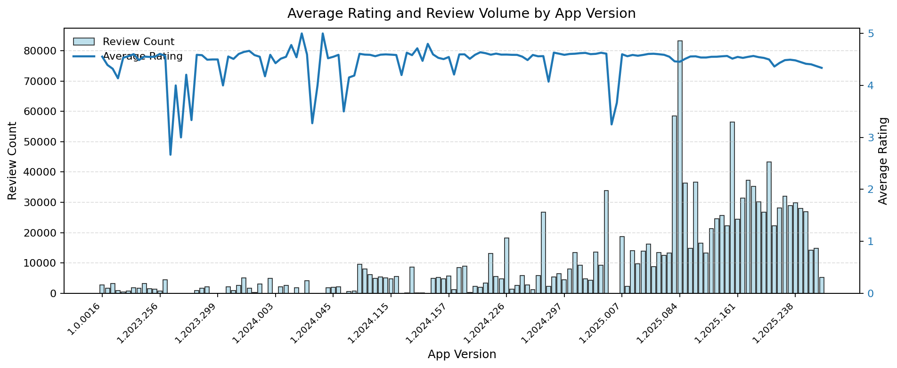

Later versions (1.2024.x–1.2025.x) show rapidly increasing review counts, indicating higher user engagement.  
A few versions (e.g., 1.2025.084) display rating dips alongside high volume, suggesting temporary performance or UX issues.  

### 8.2 Average Score & Sentiment by Version

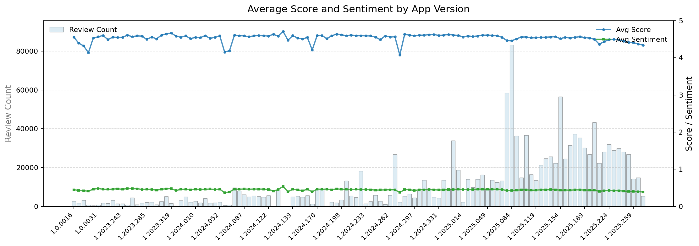

Average rating and sentiment move together across versions, but ratings show larger downside swings, implying that textual sentiment analysis may underdetect some negative nuance. In later versions (1.2025.x), both curves stabilize as review volume grows, reflecting a larger, more consistent user base.  

### 8.3 Common Bigrams/Trigrams by Rating

Positive Reviews (Score ≥ 4):  
.png)

Top phrases: good app, best app, nice app, helpful app, useful app.
These are emotionally expressive, simple, and utility-focused.  

Negative Reviews (Score ≤ 2):  
.png)

Phrases: doesn’t work, wrong answer, free version, bad experience.  
They focus on functionality breakdowns, content accuracy, and access limits.  
The repeated presence of "good app" in low ratings indicates sarcastic or mixed tone.  

### 8.4 Rating Distribution by User Activity

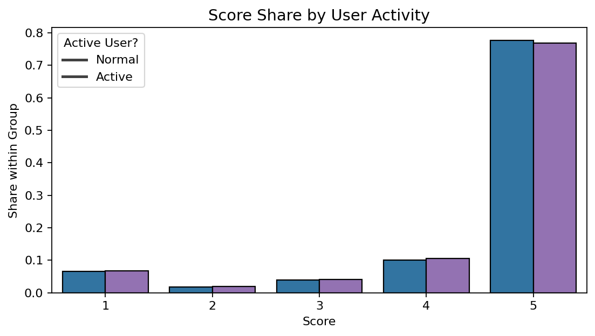

The similar rating distributions between active and one-time reviewers suggest no activity-based bias. Thus, repeated reviews from the same user can be safely retained for analysis.  

### 8.5 Sentiment, Rating, and Length Change Among Active Users

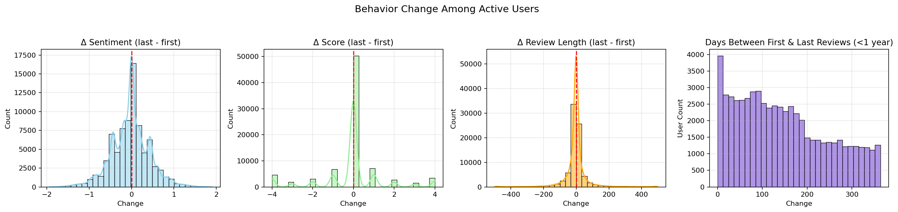

Among users who left multiple reviews:  
- 61.8% showed no rating change  
- 18.2% increased  
- 20.0% decreased  

This indicates overall stability with slight negative drift. Sentiment and score changes both center near zero, though a small subset shows large shifts (−4 ≤ Δscore ≤ 4). Text length shortens slightly over time. Median time between first and last reviews is ~186 days, suggesting users typically span multiple app releases.  

### 8.6 User Behavior Clustering

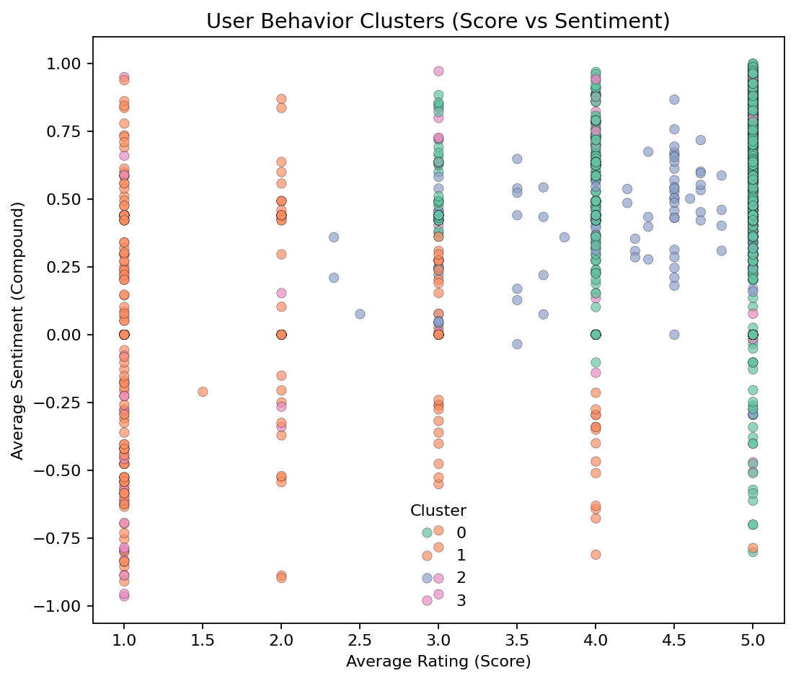

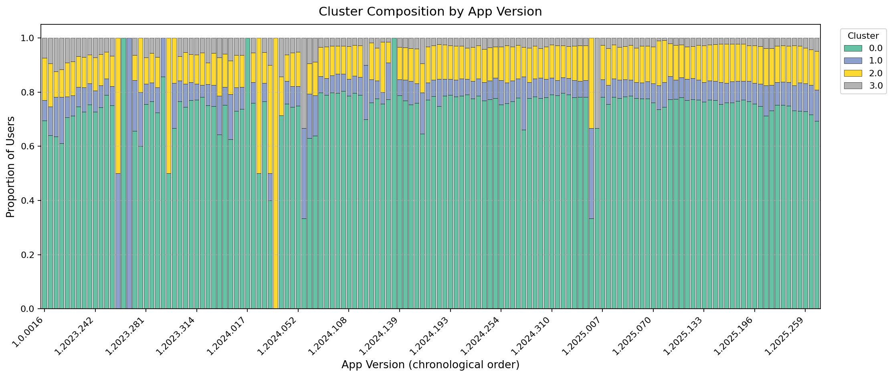

K-means clustering on 1.2M unique users (by review frequency, average rating, sentiment, and length) produced four groups:  

| Cluster | Review Count | Avg Score | Avg Sentiment | Avg Length | Interpretation |
|----------|---------------|------------|----------------|-------------|----------------|
| 0 | 1.00 | 4.85 | 0.48 | 4.37 | Highly satisfied, concise reviewers |
| 1 | 1.01 | 1.62 | −0.03 | 8.74 | Strongly dissatisfied users leaving short, negative comments |
| 2 | 2.54 | 4.54 | 0.44 | 5.26 | Moderately active, consistently positive users |
| 3 | 1.02 | 3.97 | 0.57 | 55.6 | Mixed/engaged reviewers with more expressive, longer texts |
 
Over time, the user base shifted from quick, high-score reviewers (Cluster 0) to a more diverse mix including engaged and critical users. This diversification reflects product maturity, broader adoption, and stable overall sentiment despite expanding reach.  
